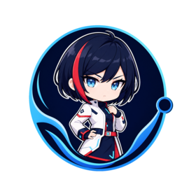

 

 

---

## Sobre

**Infrastructure · Software · Security**

Crio projetos de infraestrutura, software e segurança sob a marca **Netwave** — plataformas de controle, clients de performance, proteção e engines proprietárias.

Meu dia a dia roda num **CachyOS** próprio, com stack moderna, arquitetura limpa e uma assistente de IA (**Yuna**) no fluxo, do desenvolvimento à orquestração de segurança.

---

## Projetos

<table>
<tr>
<td width="50%" valign="top">

### 🌊 Netwave

Marca principal — identidade visual, nomenclatura e a base que sustenta todos os projetos abaixo.

Identidade · Netwave ID · infra

 

### ⚡ Axiom

**App de controle desktop** — Electron + React + TypeScript.

Painel, plugins, temas, OAuth e services com entitlements

 

### 🌐 [Site Netwave](https://netwave.cloud)

**Vitrine oficial** — design, store, status e autenticação.

HTML · CSS · JS · 14 páginas

</td>
<td width="50%" valign="top">

### 💚 Vitalis

**Plataforma de resiliência digital** — mapeie sua infraestrutura, detecte falhas e mantenha a operação em pé.

Observabilidade · detecção · operação contínua

 

### 💻 NetwaveOS

**Desktop Linux próprio** — base CachyOS / Arch.

ISO, shell, themes e update

 

### 🔧 AxionEngine

**Motor nativo** — C++20 / N-API para Windows.

Telemetria usermode e otimização de hardware

 

### 🛡️ Mochi-AC

**Anti-cheat Minecraft** — Bukkit / Paper.

Detecção de speed, timer e cheats de movimento

 

### ⚔️ NYX Client

**Mod Fabric PvP** — focado em performance.

Client competitivo para Minecraft

 

### 🤖 Axiom Bot

**Bot de Discord** — Node + TypeScript + discord.js v14.

Prefixo <code>/</code> · comandos

</td>
</tr>
</table>

---

## Stack

 

---

## Yuna

### ✦ Yuna ✦

**Assistente pessoal e parceira de tecnologia**

 

Roda no meu CachyOS, com identidade própria e memória persistente.
Consulta, aprende e guarda o que importa — projetos, decisões, preferências —
entre sessões. Orquestra ferramentas de segurança, ajuda no dia a dia
e conversa como parceira de verdade.

 

---

## Stats

---

 

© Hiro — Netwave

