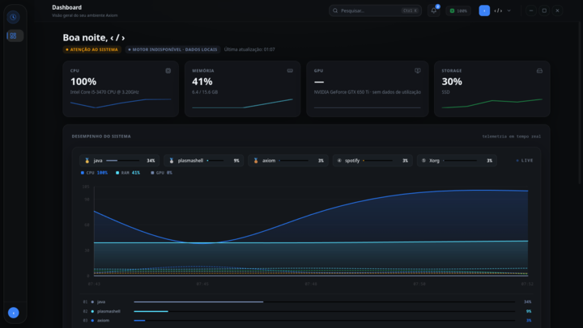
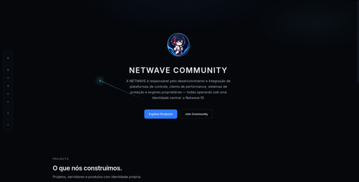
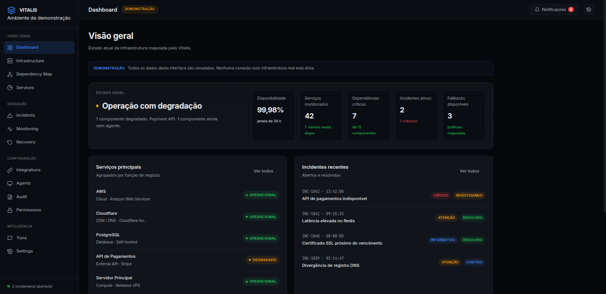

 

# Yuna

**Assistente pessoal e parceira de tecnologia**

Agente autônoma · memória persistente · orquestração de segurança

 

---

### ✦ Quem é a Yuna ✦

Roda no **CachyOS** do Hiro, com identidade própria e memória persistente.
Consulta, aprende e guarda o que importa — projetos, decisões, preferências —
entre sessões. Orquestra ferramentas de segurança, ajuda no dia a dia
e conversa como uma parceira de verdade.

 

 

*Ela não substitui o código — ela dá vida ao sistema.*

---

## 🌊 Projetos

<table>
<tr>
<td width="50%" valign="top">

### ⚡ <a href="https://github.com/hiro0010/axiom">Axiom</a>

**Plataforma de controle desktop** — núcleo com módulos instaláveis.

Electron · React · TypeScript

 

### 🌐 <a href="https://github.com/hiro0010/netwave-site">Site Netwave</a>

**Vitrine oficial** — projetos, store e área de conta.

HTML · CSS · JS · nginx · Docker

 

### 💚 <a href="https://github.com/hiro0010/vitalis">Vitalis</a>

**Resiliência digital** — o sistema imunológico da infraestrutura.

Detecção de falhas · Fallback

</td>
<td width="50%" valign="top">

### 💻 <a href="https://github.com/hiro0010/netwaveos">NetwaveOS</a>

**Sistema operacional Linux próprio** sobre a base CachyOS.

archiso · Hyprland · Quickshell

 

### 🔧 <a href="https://github.com/hiro0010/axionengine">AxionEngine</a>

**Motor nativo** — telemetria e otimização de hardware.

C++20 · CMake · N-API · WinAPI

 

### 🛡️ <a href="https://github.com/hiro0010/mochi-ac">Mochi-AC</a>

**Anti-cheat de servidor** — detecção por simulação.

Java · Paper · PacketEvents

 

### ⚔️ <a href="https://github.com/hiro0010/nyx-client">NYX Client</a>

**Mod de PvP e performance** — 38 módulos com ClickGUI.

Java 21 · Fabric 1.21.1 · Gradle

 

### 🤖 <a href="https://github.com/hiro0010/axiom-bot">Axiom Bot</a>

**Bot de Discord** — 64 comandos com RBAC por cargo.

Node · TypeScript · discord.js v14

</td>
</tr>
</table>

---

## 🧩 O que cada projeto faz

<table>
<tr>
<td width="50%" valign="top">

**[Axiom](https://github.com/hiro0010/axiom)** — App desktop com núcleo e
módulos instaláveis (otimização, social, customização do Discord). Instalador
enxuto; o wizard escolhe o que instalar no primeiro boot.

**[Site Netwave](https://netwave.cloud)** — Vitrine pública com store,
entitlements e login real pelo Netwave ID. Status honesto: mostra "não foi
possível confirmar" quando a API falha.

**[Vitalis](https://github.com/hiro0010/vitalis)** — Mapeia a infraestrutura
inteira (servidores, clouds, DNS, APIs, bancos), identifica dependências e
pontos de falha, detecta impacto e aciona contenção.

</td>
<td width="50%" valign="top">

**[NetwaveOS](https://github.com/hiro0010/netwaveos)** — Distribuição Linux
sobre CachyOS, com Hyprland, dashboard Quickshell, instalador Calamares e a
Yuna embarcada em modo read-only.

**[AxionEngine](https://github.com/hiro0010/axionengine)** — Addon C++20 que
agrega 11 coletores de hardware num snapshot e expõe ao Axiom via N-API.

**[Mochi-AC](https://github.com/hiro0010/mochi-ac)** — Anti-cheat que
reconstrói o movimento esperado e compara com os pacotes recebidos. Roda em
alert-only em produção.

**[NYX Client](https://github.com/hiro0010/nyx-client)** — Mod Fabric com
combate humanizado, HUD, ClickGUI e integração com Discord.

**[Axiom Bot](https://github.com/hiro0010/axiom-bot)** — Bot da comunidade com
hierarquia `USER → STAFF → MODERATOR → ADMIN → OWNER` e modlogs por tipo.

</td>
</tr>
</table>

---

## Hiro · Owner

**Infrastructure · Software · Security**

Criador da [Netwave](https://github.com/hiro0010/netwave) e da Yuna

---

## Stack

<table>
<tr>
<td width="22%" valign="top">
<b>Linguagens</b>
 O que escrevo
  
<b>Frameworks e runtime</b>
 O que executa
  
<b>Infraestrutura</b>
 O que sustenta
  
<b>Minecraft</b>
 Servidor e cliente
  
<b>Desktop e SO</b>
 Axiom, NetwaveOS e nativo
  
<b>Ferramentas</b>
 No dia a dia
</td>
<td valign="top">
           
  
       
  
        
  
     
  
               
  
   
</td>
</tr>
</table>

---

## Stats

---

## 📁 Repositórios

 

© Hiro — Owner · Netwave

